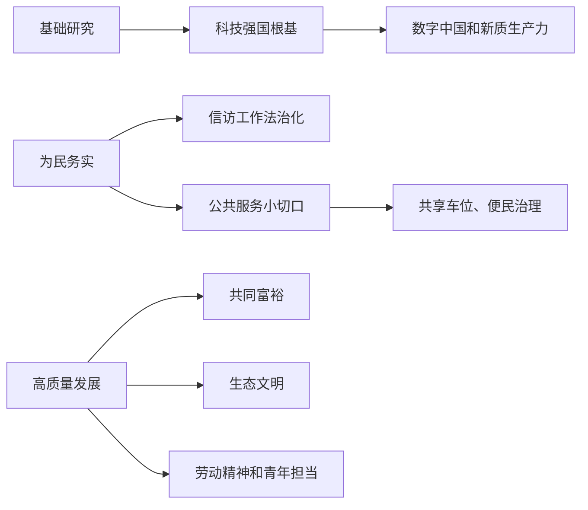

# 2026-05-01 至 2026-05-03 人民日报素材资产总览

## 一句话判断

5 月 1 日至 5 月 3 日这组文章虽然数量不大，但很适合做 5 月素材库的“开篇底座”：**科技强国要靠基础研究托底，为民治理要靠实事落地，公共服务要从闲置资源里找增量，高质量发展要把劳动、创新、生态和民生连在一起。**

如果要服务申论教学和公众号转译，本日期段最值得抓的母题是：

- 基础研究：科技强国的“源头”和“总机关”。
- 为民务实：涉及老百姓的事情，关键在实。
- 信访工作：把群众诉求纳入法治化、闭环化办理流程。
- 公共服务：共享车位这类“小切口”，能讲出治理精细化。
- 新质生产力：粉用稻、数字中国、国产算力都能写出具体场景。
- 生态文明：自然保护区建设和生态守护，体现长期主义和系统治理。

## 本日期段主线图

## 一、S 级主题：基础研究是科技强国的根基

### 核心判断

5 月 1-3 日连续出现基础研究相关稿件，是本日期段最权威、最适合作申论总论的素材。它能帮助学员理解：科技创新不能只写应用端，也要写源头端、人才端、制度端和长期投入。

### 高价值素材

| 日期 | 文章 | 可转化价值 |
|---|---|---|
| 5 月 1 日 | 《以更大力度更实举措加强基础研究 进一步打牢科技强国建设根基》 | 权威表述：基础研究是整个科学体系的源头，是所有技术问题的总机关 |
| 5 月 2 日 | 《坚定信心，进一步打牢科技强国建设根基》 | 适合做评论类表达，强调战略定力 |
| 5 月 3 日 | 《抓住机遇，以更大力度更实举措加强基础研究》 | 可作为连续性素材，说明基础研究要持续抓 |
| 5 月 3 日 | 《数智洞见未来》 | 用数字中国建设峰会，把基础研究和产业应用、数据要素、AI 场景连接起来 |

### 讲给学员的框架

申论写科技强国，不要只写“突破卡脖子技术”。更稳的表达是：

> 基础研究打源头，人才培养蓄后劲，制度保障稳预期，应用场景促转化。

这套框架能避免把科技创新写成单纯的企业研发或产品升级。

## 二、S 级主题：涉及老百姓的事情，关键在实

### 核心判断

5 月 3 日《“涉及老百姓的事情关键在实”》可以和 5 月 6 日、5 月 9 日、5 月 12 日以后的正确政绩观材料连成一条线。它的价值在于把“实”字讲清楚：深入调研、钉钉子落实、群众评判、长远规划。

### 高价值素材

| 日期 | 文章 | 关键信息 |
|---|---|---|
| 5 月 3 日 | 《“涉及老百姓的事情关键在实”》 | “事情说了，得听到落地的回响，看看落实得到底怎么样” |
| 5 月 1 日 | 《用心用情用力做好信访工作》 | 信访是了解社情民意的重要窗口，强调法治化、流程化、闭环化 |
| 5 月 3 日 | 《持续抓下去，不断抓出新成效》 | 可补充“长期抓、持续抓”的政绩观表达 |

### 讲给学员的框架

写“为民务实”可以用这条链：

> 听见诉求 - 查清问题 - 依法办理 - 协同解决 - 监督回访 - 群众评判。

这条链特别适合用于信访、热线、基层治理、公共服务等题型。

## 三、A+ 级主题：信访工作不是“接待群众”，而是治理闭环

### 核心判断

《用心用情用力做好信访工作》是一篇非常适合申论和面试的材料。它不是把信访写成简单接待，而是写成“党的群众工作 + 法治化办理 + 人民建议征集 + 矛盾源头化解”的治理流程。

### 高价值素材

| 关键信息 | 教学价值 |
|---|---|
| 2025 年，全国县级及以上领导干部接访下访 99.1 万次，接待处理信访事项 128.1 万件 | 说明领导干部下沉、主动接访的重要性 |
| 陕西绘制受理办理法治化流程图，从提出诉求到监督回访责任清晰 | 说明信访工作要规范化、流程化 |
| 天津西青区通过信访听证解决 20 年前复杂诉求 | 说明矛盾化解要有法治路径 |
| 杭州收到群众建议后建设非机动车上桥缓坡，通行从等电梯一小时变成两三分钟骑上桥 | 说明群众建议可以转化为公共治理改进 |

### 讲给学员的框架

信访工作的高分表达是：

> 把群众诉求当作问题线索，把法治流程当作办理轨道，把部门协同当作解题方式，把监督回访当作效果检验。

## 四、A+ 级主题：公共服务小切口也能写出治理大文章

### 核心判断

5 月 3 日《共享车位 高效便民》是一个典型“小切口大治理”素材。它没有宏大叙事，但特别适合写公共服务精细化、资源盘活、城市治理、假日服务保障。

### 高价值素材

| 日期 | 文章 | 可用角度 |
|---|---|---|
| 5 月 3 日 | 《共享车位 高效便民》 | 乌鲁木齐将机关企事业单位闲置车位转化为民生资源 |
| 5 月 2 日 | 《加快推进水网建设 全面提升综合效益》 | 水网建设兼具防洪减灾、水资源配置、国家水安全、航运、生态等功能 |

### 讲给学员的框架

公共服务提质，可以不只写“加大投入”。也可以写：

> 盘活存量资源，优化使用时段，公开服务信息，加强现场引导，形成可持续管理机制。

共享车位的好处在于，它能提醒学员：公共服务的增量，有时不是新建多少设施，而是把沉睡资源用起来。

## 五、A+ 级主题：新质生产力要写进产业链和应用场景

### 核心判断

5 月 3 日《推广粉用稻 专供螺蛳粉》和《数智洞见未来》一“土”一“新”，正好能说明新质生产力的两种写法：一种是农业产业链升级，一种是数字技术和 AI 场景化应用。

### 高价值素材

| 日期 | 文章 | 可用角度 |
|---|---|---|
| 5 月 3 日 | 《推广粉用稻 专供螺蛳粉》 | 专用品种、标准化育秧、无人机施肥、自动插秧、企业收购，支撑螺蛳粉产业链 |
| 5 月 3 日 | 《数智洞见未来》 | 数字中国峰会、AI、数据要素、算力设施、产业对接 |
| 5 月 1 日 | 《浙江勇挑大梁高质量发展建设共同富裕示范区》 | 创新浙江、人工智能核心产业、未来产业先导区 |

### 讲给学员的框架

新质生产力可以这样写：

> 从实验室到田间地头，从数字平台到产业链条，从技术突破到市场转化，关键是让新技术解决真实产业痛点。

粉用稻这个案例尤其好，因为它把“品种研发 - 标准种植 - 加工升级 - 市场需求 - 产业链延伸”写完整了。

## 六、A 级主题：生态文明需要长期主义和系统治理

### 核心判断

自然保护区建设、生态守护者、山水旅游等文章，适合组合成生态文明专题。它们共同强调：生态治理不能只靠一次整治，而要靠长期守护、科学监测、最小干预、保护和发展平衡。

### 高价值素材

| 日期 | 文章 | 可用角度 |
|---|---|---|
| 5 月 2 日 | 《我国自然保护区建设走过七十年》 | 自然保护区从传统巡护走向智慧监测、科学修复 |
| 5 月 2 日 | 《人不负青山 青山定不负人》 | 生态文明价值表达 |
| 5 月 3 日 | 《接力守望 山川作答》 | 一代接一代的生态守护者，可用于面试和文章开头 |
| 5 月 3 日 | 《梦起绿水青山间》 | 生态旅游、最佳旅游乡村、绿水青山转化为发展优势 |

### 讲给学员的框架

生态文明可以写成：

> 长期保护打基础，科技监测提精度，最小干预守底线，生态价值促转化。

## 七、A 级主题：劳动精神和青年担当适合做价值引入

### 核心判断

“五一”期间劳动精神和青年奋斗文章很多，但不建议逐篇深挖。更适合把它们作为文章开头、面试综合分析题、青年干部作风建设题的价值表达素材。

### 可用表达

- 劳动创造幸福，实干成就伟业。
- 大力弘扬劳模精神、劳动精神、工匠精神。
- 青年干部要把个人追求融入国家发展大局。
- 工匠精神不是慢，而是在关键处稳、在细节处精、在长期中守。

## 八、本日期段最值得开发的 6 个公众号选题

1. 《人民日报》讲透正确政绩观：涉及老百姓的事，关键在实
2. 信访工作怎么写才不低分：不是接待群众，而是把问题办成闭环
3. 公共服务小切口：共享车位为什么能写出城市治理高分答案
4. 新质生产力别写空：一碗螺蛳粉背后的粉用稻产业链
5. 科技强国怎么写：基础研究是源头，不是背景板
6. 生态文明怎么写：自然保护区的 70 年，讲的是长期主义

## 九、本日期段申论教学转译

### 综合分析题

题目示例：请结合材料，谈谈你对“涉及老百姓的事情关键在实”的理解。

答题提示：

- “实”首先体现在深入调研，真正了解群众需求。
- “实”体现在政策执行，不能停留在表态和部署。
- “实”体现在效果检验，要看群众实际感受。
- “实”体现在长远规划，不能解决一个问题、留下十个遗憾。

### 对策题

题目示例：如何提升信访工作的治理效能？

答题提示：

- 坚持领导干部接访下访，主动了解社情民意。
- 推进信访工作法治化，明确受理、办理、反馈、监督流程。
- 强化部门协同，解决历史遗留和复杂疑难问题。
- 用好人民建议征集，把群众意见转化为治理改进。
- 做好回访和评估，推动矛盾实质化解。

### 面试题

题目示例：某地节假日景区周边停车难，但机关单位停车场空置较多。你会如何推动解决？

答题提示：

- 先摸排可开放资源，明确数量、时段、安全条件。
- 协调城管、机关事务、国资等部门建立专项机制。
- 公开开放名单和位置，设置统一标识和引导人员。
- 先在节假日试点，再逐步扩展到周末和重点区域。
- 建立反馈渠道，持续优化开放范围和管理细节。

## 十、后续处理建议

优先开发顺序建议如下：

1. 先写“涉及老百姓的事，关键在实”，它能和后续正确政绩观系列自然衔接。
2. 再写“信访工作不是接待群众，而是治理闭环”，适合申论和面试双用。
3. 第三篇写“共享车位的小切口”，它很适合公众号传播，也能讲公共服务精细化。
4. “粉用稻”和“基础研究”可作为新质生产力、科技强国专题的备选素材。
