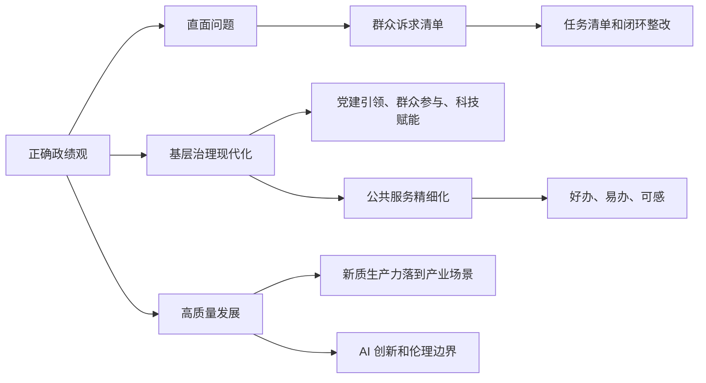

# 2026-05-04 至 2026-05-10 人民日报素材资产总览

## 一句话判断

5 月 4 日至 5 月 10 日这一周，表面上是青年、科技、产业、文旅、治理多线并行，真正的主线却很清楚：**所有“新”都要落到真实问题上。新技术要解决生产和服务痛点，新政绩观要回应群众急难愁盼，新治理要让基层更有能力、更少空转。**

如果要服务申论教学和公众号选题，本周最值得抓的母题是：

- 正确政绩观：不能“穿新鞋走老路”，要把群众诉求变成任务清单。
- 基层治理现代化：不是基层单打独斗，而是党建引领、群众参与、科技赋能、清单服务。
- 公共服务精细化：从“能办”到“好办、易办”，从设施覆盖到需求适配。
- 新质生产力：不是抽象概念，而是农机调度、北斗农业、国产医疗算法、工业智慧大脑。
- AI 治理：既要鼓励创新，也要划清底线，尤其要防止情感依赖、隐私泄露、伦理风险。

## 本周主线图

## 一、S 级主题：正确政绩观要落到“问题办理链”

### 核心判断

这一周的正确政绩观材料很完整。5 月 6 日讲“直面问题抓整改”，5 月 6 日理论版讲“不能穿新鞋走老路”，5 月 9 日讲“解决群众急难愁盼”，5 月 10 日又落到政法队伍建设。它们组合起来，正好能说明一个高分申论写法：

> 正确政绩观不是只表态，而是把问题找出来、把清单列出来、把责任压下去、把群众感受反馈回来。

### 高价值素材

| 日期 | 文章 | 可转化价值 |
|---|---|---|
| 5 月 6 日 | 《直面问题抓整改 开门教育促实效》 | “理旧账就是树新绩”、问题清单、闭环整改、问需于民 |
| 5 月 6 日 | 《践行正确政绩观，不能“穿新鞋走老路”》 | 解释形式主义、旧思维、唯 GDP 路径，适合作理论支撑 |
| 5 月 7 日 | 《善于“瞻前顾后” 为民创造政绩》 | 可补充显绩与潜绩、当前与长远的关系 |
| 5 月 9 日 | 《用心用情用力解决群众急难愁盼问题》 | “诉求清单”变“任务清单”，接诉即办、分类施策、公示销号 |
| 5 月 10 日 | 《树立和践行正确政绩观 建设德才兼备的高素质政法队伍》 | 可做队伍建设、法治治理场景中的政绩观素材 |

### 讲给学员的框架

申论写正确政绩观，可以用这条链：

> 查问题 - 列清单 - 压责任 - 抓整改 - 建机制 - 看感受。

这比单纯写“坚持以人民为中心、强化担当作为、提升治理能力”更具体。它能把抽象的政治表述转成可落地的治理动作。

## 二、S 级主题：基层治理现代化不是“万能基层”

### 核心判断

5 月 7 日《“必须抓好基层治理现代化这项基础性工作”》是这一周的核心稿之一。它把基层治理讲得很完整：党建引领、文化根基、群众协商、服务群众事项清单、科技赋能。5 月 9 日“数字淀乡”则提供了数字化治理案例。

### 高价值素材

| 日期 | 文章 | 关键信息 |
|---|---|---|
| 5 月 7 日 | 《“必须抓好基层治理现代化这项基础性工作”》 | 金元社区二维码收集建议、小院议事厅、服务群众事项清单 |
| 5 月 7 日 | 《小工程村民建 乡亲增收家园更美》 | 村级小额工程集体建，让建设、就业、监督、集体增收合在一起 |
| 5 月 9 日 | 《“数字淀乡”让乡村治理更智慧》 | 无人机巡检、5G、北斗、物联网、智能传感器进入乡村治理 |
| 5 月 9 日 | 《基层服务沉下去 科普质效提上来》 | 科普村响、点单预约、云课堂，基层服务从供给导向转向需求导向 |

### 讲给学员的框架

基层治理现代化可以拆成四句话：

> 党建把方向，群众进过程，科技提效率，服务见温度。

这周特别适合回应一个误区：基层治理不是所有事情都压给基层，而是通过清单、资源、技术和协同，让基层真正有能力把群众身边事办好。

## 三、S 级主题：公共服务从“能办”到“好办、易办”

### 核心判断

5 月 8 日《个人办事，不只“能办”还要“好办、易办”》非常适合作为申论公共服务素材。它不是宏观谈政务服务，而是把老龄补贴、不动产过户、教师资格认定这些具体场景写清楚了。

### 高价值素材

| 日期 | 文章 | 可用角度 |
|---|---|---|
| 5 月 6 日 | 《推进互助性养老服务发展》 | 到 2030 年，具备互助服务功能的城乡社区养老服务设施覆盖率不低于 70% |
| 5 月 7 日 | 《让更多农村孩子享受优质教育资源》 | 教共体、校车保障、教师轮岗、智慧课堂，推动农村教育均衡 |
| 5 月 8 日 | 《个人办事，不只“能办”还要“好办、易办”》 | 老龄补贴办理环节压缩 60%，全流程 15 个工作日压缩至 4 个工作日 |
| 5 月 8 日 | 《从“潮汐厕所”看公共服务提升》 | 公共服务要精准捕捉需求，用小而美的调整回应群众痛点 |
| 5 月 8 日 | 《这些保健品为何专“坑老”》 | 老年人权益保护、市场监管、基层宣传可组合成民生治理题 |
| 5 月 9 日 | 《基层服务沉下去 科普质效提上来》 | 科普服务从“撒胡椒面”转向群众点单、精准供给 |

### 讲给学员的框架

公共服务高分表达不是“完善服务体系”，而是：

> 场景识别 - 流程再造 - 数据共享 - 帮办代办 - 线下兜底 - 反馈改进。

尤其要记住“好办、易办”这组词。它比“便民利民”更具体，也更适合作申论规范表达。

## 四、A+ 级主题：新质生产力要写到具体场景里

### 核心判断

这一周的新质生产力素材非常适合教学，因为它不是停在“科技创新”四个字，而是落到了农机、北斗、医疗算法、机器人、无人机、工业智慧大脑、AI 能源这些场景里。

### 高价值素材

| 日期 | 文章 | 可用角度 |
|---|---|---|
| 5 月 4 日 | 《一键下单 农机到田》 | 数字平台调度农机，缓解供需不匹配，提高农机利用率 |
| 5 月 4 日 | 《“让‘中国算法’成为精准医疗的标配”》 | 国产高端医疗器械、算法攻关、精准医疗 |
| 5 月 5 日 | 《天边到田间，北斗显身手》 | 北斗技术进入农业生产 |
| 5 月 5 日 | 《青年与机器人产业共成长》 | 机器人产业与青年创新人才 |
| 5 月 6 日 | 《用数据和 AI 把家乡拖鞋卖到海外》 | 县域产业、电商出海、青年返乡创业 |
| 5 月 8 日 | 《田里流行“管理学”》 | 农业生产的组织管理和数字化升级 |
| 5 月 9 日 | 《工业“智慧大脑”卖出开门红》 | 工业互联网、智能工厂、产业链效率 |
| 5 月 10 日 | 《促进人工智能与能源双向赋能》 | 能源支撑算力，AI 赋能能源转型 |

### 讲给学员的框架

写新质生产力，不要只写“推动科技创新”。可以写成：

> 技术突破解决产业痛点，数字平台重组资源配置，青年人才推动成果转化，应用场景反过来牵引创新升级。

这套表达既能写农业，也能写制造业、医疗、能源和县域产业。

## 五、A+ 级主题：AI 治理要同时写“创新”和“底线”

### 核心判断

这一周 AI 相关素材密集，而且层次很清楚：有人工智能促进产业发展的文章，也有人工智能伦理审查、拟人化 AI 监管、科技伦理风险的文章。特别适合训练学员写“包容审慎监管”。

### 高价值素材

| 日期 | 文章 | 可用角度 |
|---|---|---|
| 5 月 7 日 | 《为人工智能创新划清底线》 | 科技伦理要贯穿 AI 活动全过程 |
| 5 月 7 日 | 《合力监管“拟人化 AI”服务》 | 防止替代社会交往、控制用户心理、诱导沉迷依赖 |
| 5 月 10 日 | 《人工智能科技伦理审查与服务先导计划启动》 | 建设伦理委员会、审查服务中心、风险监测网络 |
| 5 月 10 日 | 《促进人工智能与能源双向赋能》 | 算力用电和能源转型互相影响，AI 发展要考虑资源支撑 |

### 讲给学员的框架

AI 治理可以写成两句话：

> 发展上给空间，治理上守底线。既要开放场景、释放创新潜力，也要通过伦理审查、标准规范、协同监管防范风险。

这比简单写“加强监管”更成熟，也能体现权衡意识。

## 六、A 级主题：文化空间、乡村振兴与城市文脉

### 核心判断

这一周的文化和乡村素材很适合公众号，但申论使用时要筛选。真正好用的不是“文化很重要”，而是文化资源怎样进入公共服务、产业发展、乡村治理和城市更新。

### 高价值素材

| 日期 | 文章 | 可用角度 |
|---|---|---|
| 5 月 7 日 | 《家门口的文化生活有滋有味》 | 全国新型公共文化空间 4 万多个，公共文化服务更贴近群众 |
| 5 月 8 日 | 《向下扎根的“村播”何以向上生长》 | 村播连接田间地头和消费市场，带动农产品销售、农技传播、乡村旅游 |
| 5 月 10 日 | 《以“最大耐心”留住烟火 以“最小干预”守住历史》 | 绍兴古城保护：法治护航、数字孪生、原住居民和历史文脉共生 |
| 5 月 5 日 | 《吴桥：“杂技+”走出融合路》 | 非遗和文旅融合，可做文化传承与产业融合素材 |

### 讲给学员的框架

文化类材料可以这样转：

> 文化资源不能只停在保护层面，还要进入公共空间、日常生活、消费场景和基层治理，让传统文脉变成可体验、可参与、可持续的现代生活。

## 七、本周最值得开发的 8 个公众号选题

1. 《人民日报》讲透正确政绩观：别“穿新鞋走老路”，要把群众诉求变成任务清单
2. 基层治理现代化怎么写：党建引领、群众参与、科技赋能、清单服务
3. 公共服务不是“能办”就够了：从老龄补贴到潮汐厕所，看“好办、易办”的高分写法
4. 新质生产力别写空：农机、北斗、算法、工业大脑里的申论素材
5. AI 治理怎么写才高级：既给创新空间，也给伦理底线
6. 村播为什么不是简单带货：它连接的是乡村产业、农技传播和共同富裕
7. 古城保护别只写修旧如旧：绍兴这篇讲透“最大耐心、最小干预”
8. 农村教育均衡怎么写：从海岛教共体到校车专线，看公共服务均等化

## 八、本周申论教学转译

### 综合分析题

题目示例：请结合材料，谈谈你对“践行正确政绩观，不能‘穿新鞋走老路’”的理解。

答题提示：

- “穿新鞋走老路”的本质是形式主义，是用新概念包装旧思维、旧路径。
- 正确政绩观要求完整准确全面贯彻新发展理念，不能只追求短期显绩。
- 解决办法是深入调查研究，直面问题，建立清单，闭环整改。
- 评价标准要回到群众获得感和长远发展成效上。

### 对策题

题目示例：如何推动政务服务从“能办”向“好办、易办”转变？

答题提示：

- 从群众高频事项和痛点堵点切入，梳理“一件事”清单。
- 推动部门数据共享和流程再造，减少材料、环节和办理时限。
- 保留线下窗口、帮办代办和上门服务，照顾老年人等特殊群体。
- 建立“好差评”和复盘机制，把个案经验转化为制度规则。
- 通过数字技术提升效率，但不能把技术门槛变成新的办事负担。

### 面试题

题目示例：你所在街道准备推进基层治理数字化，但部分群众担心不会用、基层干部担心增加负担。你怎么推进？

答题提示：

- 先调研真实需求，不为上系统而上系统。
- 选取高频、具体、低风险场景试点，比如环境巡查、诉求反馈、养老帮扶。
- 设置线下辅导和人工兜底，避免数字鸿沟。
- 明确平台事项边界和部门责任，避免把所有问题压给基层。
- 通过群众反馈和干部使用体验不断优化。

## 九、这周不建议优先开发的内容

- 纯节日表态类、青年口号类文章：适合作背景，不适合单独成文。
- 过宏观的国际评论类文章：和当前申论教学主线关系较弱。
- 文化遗产考古短稿：可入素材库，但除非组合成“城市文脉”专题，否则暂不优先。
- 纯政策发布短讯：可以作为权威依据，但需要搭配具体案例使用。

## 十、后续处理建议

优先开发顺序建议如下：

1. 先写“正确政绩观：不能穿新鞋走老路”，它和上一周材料能连续成系列。
2. 再写“公共服务从能办到好办、易办”，读者感受强，也适合申论。
3. 第三篇写“基层治理现代化不是万能基层”，承接 5 月 7 日核心稿。
4. 后续再开发“AI 治理”和“新质生产力场景化表达”，作为热点专题储备。
