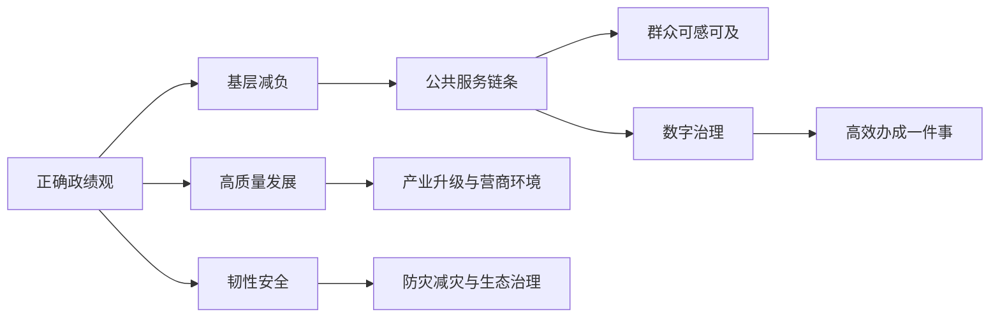

# 2026-05-11 至 2026-05-17 人民日报素材资产总览

## 一句话判断

5 月 11 日至 5 月 17 日这组文章，真正值得抓的不是某一篇单稿，而是一条很完整的申论主线：**正确政绩观不是口号，而是把问题识别出来、把权责理顺起来、把服务链条接起来、把群众感受反馈回来。**

如果后面要写公众号文章，这一周最值得持续开发的母题是：

- 正确政绩观：从“讲实话、办实事、求实效”到基层减负、服务闭环。
- 公共服务均等化：从“有服务”到“服务能不能在家门口接住人”。
- 基层治理现代化：从“万能基层”到权责清、资源下沉、部门协同。
- 新质生产力与传统产业：不是只写高科技，而是写老产业怎样用技术、绿色、品牌、法治环境重做一遍。
- 韧性治理：从灾后处置转向风险预警、基层能力、系统协同。

## 本周主线图

## 一、S 级主题：正确政绩观与基层减负

### 核心判断

这一周连续出现多篇文章，足以支撑一组“正确政绩观”专题。它们不是重复讲概念，而是把政绩观拆成了四个可操作环节：

1. 目标要实：不搞花架子，不搞形象工程。
2. 过程要实：调研不能只“身入”，还要“心入”。
3. 机制要实：不合理证明、重复填表、过度考核要从制度上减掉。
4. 结果要实：看群众获得感，看基层能不能轻装上阵。

### 高价值素材

| 日期 | 文章 | 可转化价值 |
|---|---|---|
| 5 月 12 日 | 《把“实”字贯穿树立和践行正确政绩观全程》 | 可做总论，关键词是讲实话、办实事、求实效 |
| 5 月 13 日 | 《治标又治本，卸下隐形负担》 | 可做基层减负案例，亮点是“一表通”、证明清理、减少重复调研 |
| 5 月 14 日 | 《一体推进整治形式主义为基层减负》 | 可做系统性论证，说明基层减负不是少开几个会，而是纠治政绩观错位 |
| 5 月 16 日 | 《深学笃行习近平总书记关于树立和践行正确政绩观的重要论述》 | 可做权威表述来源，适合作申论文章开头或结尾 |

### 可讲给学员的框架

申论里写“正确政绩观”，最怕写成口号。本周材料提供了一个更稳的写法：

> 先校准价值取向，再清理制度负担，再压实部门责任，最后用群众感受检验治理成效。

这比“坚持人民至上、强化担当作为、提升治理效能”这种泛泛三段式更有画面，也更像人民日报的表达。

## 二、S 级主题：公共服务均等化与服务链条

### 核心判断

本周公共服务类素材非常密集，覆盖医疗、社区、热线、互联网医院、上学路、便民服务。它们共同说明一个问题：公共服务均等化不能只写“覆盖更多人”，还要写清楚服务是否真的抵达、是否连续、是否适配不同群体。

### 高价值素材

| 日期 | 文章 | 关键信息 |
|---|---|---|
| 5 月 11 日 | 《我国加快建设分级诊疗体系》 | 全国医疗卫生机构超过 110 万个，约 90% 的居民 15 分钟内可到达最近医疗点 |
| 5 月 11 日 | 《从“办事窗口”到“邻里客厅”》 | 重庆奉节“渝好空间”把托管、家政、互助嵌入社区空间 |
| 5 月 11 日 | 《热线电话“打通难”，难在哪》 | 热线接不通不是小问题，而是服务细节和兜底渠道问题 |
| 5 月 14 日 | 《让百姓在家门口能看好病》 | 基层医疗用远程会诊、共享药房、大学生村医增强服务能力 |
| 5 月 15 日 | 《便民服务要摸准需求》 | 便民服务不能等群众开口，要识别“未说出口”的真实需求 |
| 5 月 15 日 | 《互联网医院，离建好用好还有多远》 | 互联网医院要解决标准、响应、配送、医保、适老化和监管问题 |
| 5 月 17 日 | 《最美上学路是什么样的》 | 城市治理从道路安全、儿童友好、公共空间品质切入 |

### 可讲给学员的框架

公共服务均等化可以写成一条“办理链”：

> 需求识别 - 资源下沉 - 流程整合 - 数字赋能 - 线下兜底 - 反馈改进。

这条链条特别适合申论综合分析题和对策题。比如问“如何提升基层公共服务水平”，不要只答“加大投入、完善机制、加强宣传”，而要写出服务从哪里来、谁来办、怎么接、怎么反馈。

## 三、A+ 级主题：高质量发展与传统产业升级

### 核心判断

这周产业类文章的好处是很接地气。它没有只讲“人工智能、未来产业”，而是反复写传统产业怎样通过智能化、绿色化、品牌化、法治化实现跃升。

### 高价值素材

| 日期 | 文章 | 可用角度 |
|---|---|---|
| 5 月 11 日 | 《福建推进民营经济高质量发展》 | 民营经济、创新投入、入企办公、营商环境 |
| 5 月 12 日 | 《增智逐绿 中国制造聚力创新》 | 智能制造、绿色制造、工业互联网、机器人密度 |
| 5 月 12 日 | 《改造升级 传统产业提质增效》 | 传统产业不是落后产业，关键看能否改造升级 |
| 5 月 13 日 | 《杭集牙刷，何以“刷”遍全球？》 | 小镇产业、专精特新、智能工厂、外贸竞争力 |
| 5 月 14 日 | 《把法治资源转化为发展优势》 | 法治化营商环境、扫码入企、无事不扰 |
| 5 月 17 日 | 《从一粒海盐看产业链延伸》 | 资源禀赋转化为产业链、价值链 |

### 可讲给学员的框架

写传统产业升级，不要把它写成“淘汰旧产业、发展新产业”。人民日报这周给出的写法更稳：

> 老产业 + 新技术 + 新标准 + 新组织 + 新市场 = 新质生产力的现实落点。

这个框架很适合讲“因地制宜发展新质生产力”。它能提醒学员，新质生产力不是只在实验室和高新区，也可以长在阀门、牙刷、海盐、玻璃、纺织这些具体产业里。

## 四、A+ 级主题：数字治理与技术边界

### 核心判断

这周数字治理素材的质量也不错，但需要注意：人民日报不是把数字化写成“万能药”，而是强调数字技术必须服务真实问题，不能制造新的形式主义。

### 高价值素材

| 日期 | 文章 | 可用角度 |
|---|---|---|
| 5 月 11 日 | 《以数智技术赋能“高效办成一件事”》 | 数据共享、部门协同、远程窗口、闭环反馈 |
| 5 月 15 日 | 《互联网医院，离建好用好还有多远》 | 线上线下衔接、适老化、质控监管 |
| 5 月 15 日 | 《构建高效协同智慧的生态环境治理体系》 | 智慧监测、非现场监管、精准执法 |
| 5 月 17 日 | 《科研有了“AI 搭子”》 | AI 赋能科研，同时要守住责任边界 |

### 可讲给学员的框架

数字治理的高分表达不是“推进数字化建设”，而是：

> 用数据打通部门壁垒，用算法提升治理精度，用线下渠道兜住特殊群体，用反馈机制纠正技术偏差。

这里尤其要提醒学员：数字化不能取消线下窗口，不能把老人、弱势群体、低数字能力人群挡在门外。

## 五、A 级主题：韧性安全与生态治理

### 核心判断

防灾减灾、极端天气、生态治理、生物多样性这些文章，可以组合成“韧性治理”专题。它们共同强调：治理不能只在出事后救火，而要把风险识别、物资前置、基层能力、数据监测提前做起来。

### 高价值素材

| 日期 | 文章 | 可用角度 |
|---|---|---|
| 5 月 12 日 | 《构建完善应对极端天气的防治体系》 | 系统应对、科技赋能、基层一线 |
| 5 月 13 日 | 《筑牢安全防线 守护万家灯火》 | 大安全大应急框架、物资前置、灾害信息员 |
| 5 月 13 日 | 《改善城市环境 提升生物多样性》 | 城市生态修复、生物多样性、生态空间 |
| 5 月 15 日 | 《构建高效协同智慧的生态环境治理体系》 | 天空地海一体化监测、精准执法 |

### 可讲给学员的框架

韧性治理可以写成四句话：

> 风险早识别，资源早前置，基层有能力，系统能联动。

这比单纯写“完善应急预案、加强宣传教育、提高防范意识”更具体。

## 六、A 级主题：城市更新、文化传承与日常生活

### 核心判断

城市更新和文化传承类文章的优势是画面感强，适合公众号转译。它们不是抽象谈“保护文化遗产”，而是写地铁如何绕开文物、文物如何进入展厅、公共文化资源如何走向基层、孩子上学路如何变成城市治理的尺度。

### 高价值素材

| 日期 | 文章 | 可用角度 |
|---|---|---|
| 5 月 14 日 | 《有效推动优质公共文化资源直达基层》 | 公共文化服务均等化、文化资源下沉 |
| 5 月 15 日 | 《当地铁与文物相遇》 | 考古前置、城市建设与文物保护协同 |
| 5 月 17 日 | 《最美上学路是什么样的》 | 儿童友好、城市精细化治理 |
| 5 月 17 日 | 《让城市体检更好服务城市更新》 | 先体检再更新，治理从诊断开始 |

### 可讲给学员的框架

城市更新不是“拆旧建新”，而是：

> 先体检、再更新；先保护、再利用；先问需、再建设；让历史文脉和公共服务一起进入日常生活。

## 七、本周最值得开发的 8 个公众号选题

1. 《人民日报》讲透正确政绩观：不是喊口号，而是把基层负担从源头减掉
2. 公共服务均等化怎么写才不空：从分级诊疗到互联网医院，看人民日报的“服务链”写法
3. 基层治理不是“万能基层”：权责清、群众进、部门协同
4. 新质生产力不是只写 AI：牙刷、阀门、海盐里的产业升级课
5. 便民服务为什么不能只等群众开口：人民日报这篇小稿，藏着治理高分答案
6. 热线电话接不通，为什么是治理问题：从一个电话看公共服务兜底能力
7. 城市更新别急着拆：地铁与文物相遇，讲透“保护也是发展”
8. 韧性治理怎么写：从极端天气到生态监测，人民日报给出四个关键词

## 八、本周申论教学转译

### 综合分析题

题目示例：请结合材料，谈谈你对“基层减负不是减责任，而是减掉不必要的形式主义负担”的理解。

答题提示：

- 基层减负不是让基层少作为，而是让基层从无效事务中解脱出来。
- 形式主义负担的本质，是政绩观错位、权责不清、评价导向偏差。
- 减负要从会议、文件、报表、证明、检查、考核等具体事项入手。
- 减负之后还要把资源、权限、力量下沉，让基层能更好服务群众。

### 对策题

题目示例：如何提升基层公共服务的可及性和均等化水平？

答题提示：

- 精准识别群众需求，尤其是老人、儿童、偏远地区群众的隐性需求。
- 推动资源下沉，增强基层医疗、托育、家政、应急、文化等服务能力。
- 整合线上线下渠道，既用数字技术提效率，也保留线下兜底服务。
- 建立反馈闭环，从解决一个问题走向优化一类流程。
- 明确部门责任，避免把所有事项简单压给基层。

### 面试题

题目示例：某地政务热线经常打不通，群众反映强烈。你作为相关部门工作人员，怎么办？

答题提示：

- 先核查问题类型：忙线、无人接听、号码失效、转接不畅、回复不及时。
- 建立台账，区分技术问题、人员配置问题、流程问题和责任问题。
- 优化接听、转办、反馈流程，设置回访和短信告知机制。
- 对确需线上办理的事项，提供替代渠道和人工引导。
- 定期公开整改情况，把热线从“接电话”变成“接问题”。

## 九、这周不建议优先开发的内容

- 纯会议类、版面类、责编类记录：适合归档，不适合转成公众号文章。
- 过于宏观的理论文章：可作为权威表述来源，但不要单独写成长文，容易显得空。
- 同质化产业稿：如果没有具体案例、数字、机制，就先放入素材库，不急着出文章。
- 文化遗产系列短稿：可做配角素材，暂不建议单篇展开，除非组合成“城市更新与文物保护”专题。

## 十、后续处理建议

优先顺序建议如下：

1. 先把“正确政绩观 + 基层减负”做成一个系列母题。
2. 再把“公共服务均等化”做成一篇面向申论学员的公众号文章。
3. 然后开发“传统产业里的新质生产力”，适合做产业类常考素材。
4. 最后把“韧性治理”和“城市更新”作为备选专题，用于补充面试和综合分析题。
